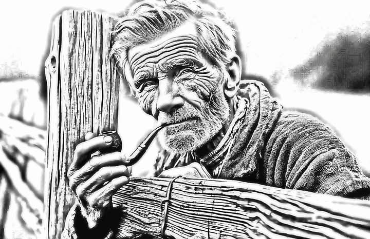
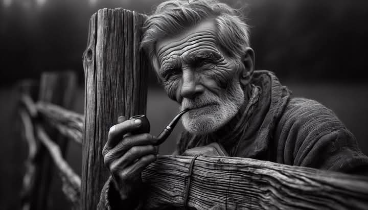

# LaserBase-Sketch

Photo → engraving-ready line image generator  
Fotó → gravírozható vonalas kép előállító

### Result

### Generated drawing

### Source photo

---

## What is this?

This tool converts a photo into a line-style image that can usually be engraved directly in LightBurn with minimal cleanup.

It is NOT an engraving software and not a vectorizer replacement.  
It is a preprocessing step to shorten the typical image preparation workflow.

Typical workflow:

photo → LaserBase-Sketch → LightBurn → engrave

---

## Mi ez?

Ez az eszköz egy fotóból olyan vonalas képet készít, amely legtöbbször közvetlenül gravírozható LightBurn-ben, csak minimális utómunkával.

NEM gravírozó szoftver és nem vektorizáló program helyettesítője.  
Egy előkészítő lépés, ami lerövidíti a szokásos képfeldolgozási folyamatot.

Tipikus munkamenet:

fotó → LaserBase-Sketch → LightBurn → gravírozás

---

## Best results / Mikor működik a legjobban

**Works best with:**
- good contrast photos
- visible texture (wood, fabric, wrinkles, hair, objects)
- natural lighting
- medium to high detail images

**Nem ideális:**
- homogén árnyalatú grafikákhoz
- alacsony kontrasztú selfie-hez
- túlexponált képekhez
- sima bőrű portrékhoz

---

## Goal / Cél

Reduce manual cleanup and multi-software preparation.  
Not to automatically create a perfect drawing.

A kézi javítás és a több programos előkészítés csökkentése,  
nem tökéletes rajz automatikus létrehozása.

---

## Technical description

Photo-to-drawing reconstruction tool.

Creates clean line art by analyzing shapes instead of applying filters or tracing outlines.

The goal is not to preserve the photograph but to rebuild it as a readable drawing suitable for engraving, printing or illustration.

### How it works

Internally the image is analyzed as two components:

- Tone — surfaces and shading
- Contour — edges and structure

Then the image is rebuilt from these instead of editing pixels.

Result: a structured drawing, not a photo effect.

### Why it is different

This is not:

- a filter
- an edge overlay
- an SVG tracer
- a background remover

The image is analyzed and redrawn based on forms.

### Features

- Photo → clean line drawing
- Structure-based reconstruction
- Adjustable detail level
- Manual cleanup tools
- Vector line reconstruction
- Continuous contour rebuilding
- Suitable for engraving and illustration

### Vector reconstruction

Contours can be rebuilt as continuous paths.  
This removes broken edges and noise and produces smoother lines.

Important for:

- portraits (eyes, mouth)
- buildings (straight lines)
- logos (closed shapes)

Vector parameters modify the structure of the drawing, therefore they are applied as a rebuild step instead of live preview.

---

## Usage

1. Open image
2. Choose drawing mode
3. Adjust detail and line strength
4. Optionally reconstruct lines
5. Export result

---

## Download

Prebuilt executable is available in Releases.

No installation required. Extract and run.

---

## Notes

The quality of the original image strongly affects the result.  
The program reconstructs structure — it cannot invent missing information.

---

## License

This software is free to use but not open source.

You may use and download it.  
You may not modify, redistribute modified versions, or sell it.

See LICENSE.txt for details.* Manual cleanup tools
* Vector line reconstruction
* Suitable for engraving and illustration

---

## Vector reconstruction

Contours can be rebuilt as continuous paths.

This removes broken edges and noise and produces smoother lines.

Important for:

* portraits *(eyes, mouth)*
* buildings *(straight lines)*
* logos *(closed shapes)*

Vector parameters modify the structure of the drawing,
therefore they are applied as a rebuild step instead of live preview.

---

## Usage

1. Open image
2. Choose drawing mode
3. Adjust detail and line strength
4. Optionally reconstruct lines
5. Export result

---

## Download

Prebuilt executable is available in **Releases**.

No installation required.
Extract and run.

---

## Notes

The quality of the original image strongly affects the result.
The program reconstructs structure — it cannot invent missing information.

---

## License

This software is free to use but **not open source**.

You may use and download it.
You may not modify, redistribute modified versions, or sell it.

See `LICENSE.txt` for details.
